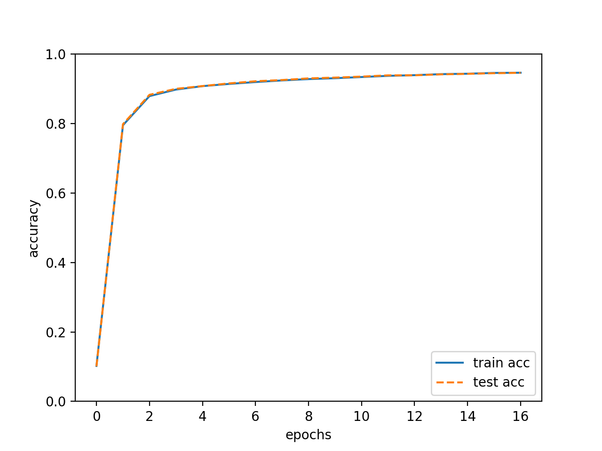
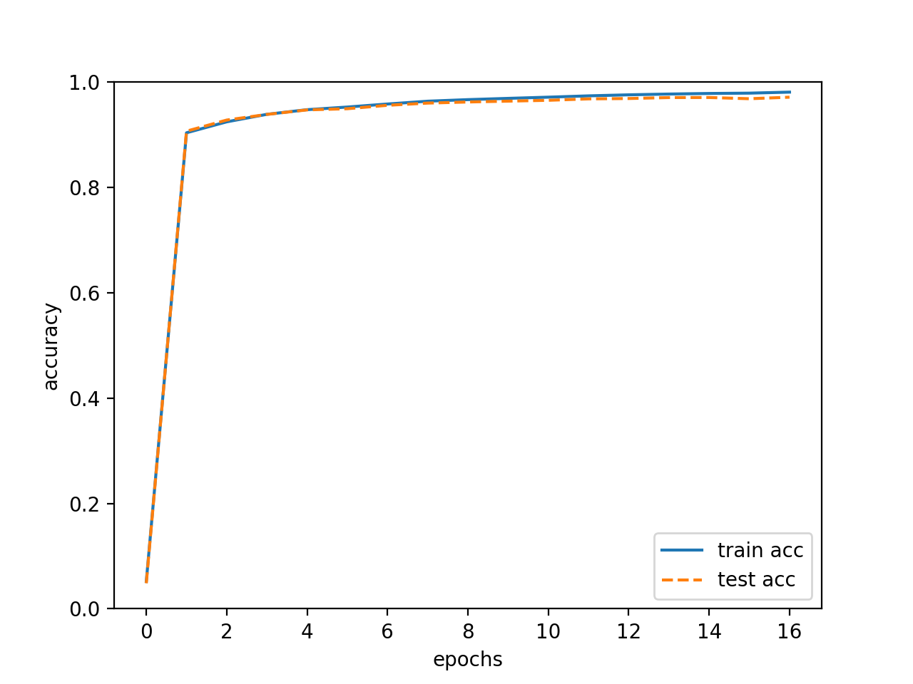

# neural-network-exercise
ニューラルネットワーク/ディープラーニングの学習のため、再実装や実験などを行うレポジトリ

### ゼロから作るディープラーニング
#### Using Sigmoid (train acc, test acc | 0.9464, 0.9462)   
   

#### Using ReLU (train acc, test acc | 0.9809, 0.9713)

#### Gradient Check (Compare numerical_gradient and backpropagation_gradient)   
num 4.908322095870972 [sec]   
back 0.0005049705505371094 [sec]   
W1:4.4909530255078593e-10   
b1:2.474440710322108e-09   
W2:5.425460169140406e-09   
b2:1.3941928355687417e-07   
※ 微小ではあるが、本より大きい…実装確認する

### 参考資料
+ [ゼロから作るディープラーニング](https://www.oreilly.co.jp/books/9784873117584/)
